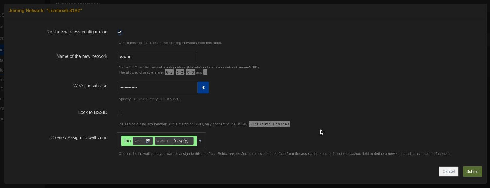

 

# Build your own LoRaWAN Gateway

There are many ways to build a LoRaWAN Gateway. In our study case, we want to collect environnemental data from oudoor sensor. Probabilities that gateways are stored also outdoor to mainain a good commmunication with sensors are high, so we need waterproof gateways.

## Ready-to-use Gateway
The easiest way to obtain this is to buy a [ready-to-use Gateway](https://sparwan.com/smart-office-/115-passerelle-lorawan-ug63-868m-6974225038176.html). 

**Budget** : 200-300€**

::: danger WARNING
Many ready-to-use Gateways are  not compatible with [Chirpstack](https://www.chirpstack.io/docs/). Don't forget to check the userguide and technical manual.

Most ready-made gateways have been designed for indoor use. If you want to use it outdoor, you will have to protect it against water, by storing it in a [waterproof case](https://www.mhzshop.com/shop/Accessoires-MHz/Boites-etanches/Boite-etanche-avec-fixation-mat-203x203x65mm-GentleBOX-JE-200.html?force_sid=2hgj0f0gqk547k0sul2s8sebe0), or by simply choosing a really expansive [adapted Gateway](https://envytech.fr/boutique/milesight-ug67-passerelle-lorawan-exterieure/?attribute_version=Antennes+externes++4G+embarqu%C3%A9&utm_source=Google+Shopping&utm_campaign=TWENGA&utm_medium=cpc&utm_term=16474&gad_source=1).
:::

## Homemade Gateway

The second main method we are going to present here is more complex, and not so much economical. Advantage here is the compaibility : as we completely build the Gateway, we are free to manage its source-code, and so limit compataibily problems with ChirpStack. Our method is inspired by that of the [Tetaneutral project](https://docs.lora.tetaneutral.net/).

::: details What is the Tetraneutral project ?
The aim of this benevol initiativ is to develop a free LoRaWAN Network in Toulouse (FR).

**Gateways**
They propose several gateways model to contribute to their network. The kit IMST Lite Gateway is the most interesting one, and contains : 
- a housing
- a pre-certified concentrator iC880A-SPI
- a Raspberry Pi
- a pre-configured SD-card

To run, it needs a battery and an antenna. 

**Budget** : 320-360€

**Temperature sensor**
They created a test temperature sensor with the following components : 
- Feather M0 : it carries an AM Cortex M0 processor (the same as the Arduino Zéro's one), a LoRa module (SX127x with SPI interface) and has 256Ko of memory.
- DS18B20 temperature sensor
- Battery
- Antenna

**Budget** : 70-100€
:::

### Materials

| Component | Description |
| --- | --- |
| [Raspberry Pi 2 Model B](https://www.ldlc.com/fiche/PB00182827.html) |  |
| [Antenna 3.5dBi - 7.5dBi](https://www.distrelec.fr/fr/antenne-wi-fi-blanc-dbi-rp-tnc-male-168-5mm-vis-cisco-air-ant2524dw/p/30244239?trackQuery=cat-DNAV_PL_3525686&pos=2&origPos=2&origPageSize=50&track=true&sid=fcfebca9204ef3f78f3df2c3975f650e60a4bdb0) | |
| [Pigtail cable](https://shop.imst.de/wireless-modules/accessories/20/u.fl-to-sma-pigtail-cable-for-ic880a-spi) | |
| [iC880A-SPI - LoRaWAN Concentrator 868 MHz](https://shop.imst.de/wireless-modules/lora-products/8/ic880a-spi-lorawan-concentrator-868-mhz) | Multi-channel high performance transmitter/receiver module designed to receive several LoRa packets simultaneously using different spreading factors on multiple channels.  |
| [Power supply](https://www.reichelt.com/fr/fr/raspberry-pi-alimentation-5-1-v-2-5-a-micro-usb-prise-eu--rpi-ps-12-5eu-wt-p316266.html?PROVID=2810&gclid=Cj0KCQjwqP2pBhDMARIsAJQ0Czpc3bBkE3_ikJIpAeRvJ_jcr3drtYX6xJQLGIfDlgioRUuo5VOfEC8aAtn5EALw_wcB) | |
| [Waterproof case](https://www.mhzshop.com/shop/Accessoires-MHz/Boites-etanches/Boite-etanche-avec-fixation-mat-203x203x65mm-GentleBOX-JE-200.html?force_sid=2hgj0f0gqk547k0sul2s8sebe0) |  |
| 7x dual female jumper wires |  |
| Micro SD card (4GB) |  |
| Ethernet cable |  |
| | **Total**  |  300-350€  |

*Source : [TheThingsNetwork](https://www.thethingsindustries.com/docs/gateways/models/raspberry-pi/)*

::: tip What is a shield ? What is the difference with a HAT ?
Arduino shield is a board that can be plugged on top of the Arduino PCB extending its capabilities. A HAT is the same, but for Raspberry Pi
:::

::: details Subsitutes iC880A-SPI
In our tutorial, we are working with a [PG1302 LoRaWAN Concentrator](https://www.dragino.com/products/lora/item/223-pg1302.html). Others compatible HAT and shields are listed in the [ChirpStack documentation](https://www.chirpstack.io/docs/chirpstack-gateway-os/hardware-support.html#supported-shields).
:::

 <i> Components used for our home-made gateway </i>

If your are not friendly with informatic assembly, you can also work with these multi-channels **Gateway kits** : 
- [IMST kit](https://shop.imst.de/wireless-modules/lora-products/36/lite-gateway-demonstration-platform-for-lora-technology?number=409820), for **299€**
- [RAK D0 kit](https://store.rakwireless.com/products/rak7246-lpwan-developer-gateway?variant=36313275465886&utm_source=RAK7246GDeveloperD0%2B&utm_medium=Document&utm_campaign=BuyFromStore), for **100€**

### Assembly

**1. Flash the SD card :**

As explained in the [ChirpStack documentation](https://www.chirpstack.io/docs/), you need to install several packages :
- ChirpStack Gateway OS
- Chirpstack Concentratod
- ChirpStack MQTT Forwarder

To do this, you have to flash a ChirpStack image on the SD card contained in your raspberry pi. You can choose between two images :
- the *base* one, which contains all necessary packages to build a gateway conntected to a external ChirpStack Network Server, i.e. ChirpStack Gateway OS, Concentratod and MQTT Forwarder
- the *full* one, which has the same contains as the *base* image plus all packages needed to transform your gateway into a Network Server, i.e. to host ChirpStack.
    
To flash your SD Card, you can use [Balena Etcher](https://etcher.balena.io/) if you are working on linux or [Win32DiskImager](https://win32diskimager.org/) if you are working on windows. Then, insert it in your Raspberry-Pi.

 <i> Insert the flashed SD card </i>

**2. Plug the LoRaWAN HAT**

The second step is to connect your LoRaWAN HAT to your Raspberry-Pi and attach it.

    

        
    

    

        
    

    

        
    

 <i> Fix the LoRaWAN HAT on the Raspberry-Pi </i>

::: tip Reminder
In our tutorial, we are working with a [PG1302 LoRaWAN Concentrator](https://www.dragino.com/products/lora/item/223-pg1302.html). Others compatible HAT and shields are listed in the [ChirpStack documentation](https://www.chirpstack.io/docs/chirpstack-gateway-os/hardware-support.html#supported-shields).
:::

**3. Set the incoming HAT intensity**

Set the intensity of the incoming power to 5V, by moving the yellow plastic holder.

 <i> Set the tension to 5V </i>

**4. Plug the radio and GPS antennas**

Radio and GPS connector locations depends on your LoRaWAN HAT. In our case, it is on the right for the GPS and in the middle for the antenna.

    

        
    

    

        
    

 <i> Connect the radio and GPS antennas to the LoRaWAN HAT </i>

**5. Protect your gateway in an adapted case**

 <i> Store the gateway in a case </i>

**6. Power on your gateway**

Once powered on and linked to your internet box via ethernet, wait a few minutes. Then you will see different LeDs on. If you do not, it means you made a mistacke in the building or in the preparation of the SD card.

::: warning WARNING
Do not forget to connect the radio antenna to your gateway BEFORE powering it on : it may damage your LoRaWAN hub.
:::

 <i> Connect the radio antenna and power on your gateway </i>

For further informations about this assembly, check out this other [similiar tutorial](https://www.thethingsindustries.com/docs/gateways/models/raspberry-pi/), made by TheThingsNetwork.

LeDs are on ? Congrats ! Your LoRaWAN gateway is ready-to-use. Let's configure it to connect it to your ChirpStack Network Server.

## Configuration
### Gateway ID

Now your Gateway is powered on, let's connect to its web interface to configure it. Curl its IP adress by checking the web interface of your internet box, and paste it in the URL bar of your web navigator.

If the SD card of your gateway is well flashed, you should arrive on a ChirpStack login page, to acess to your device settings. The login *root* should be pre-filled. At this stage, no password is defined for your gateway, so just clik on *Login*. 

 <i> ChirpStack connection interface of your gateway </i>

We advise you to configure a password for you gateway as soon as possible, to enforce its security.

Second step is to get your gateway ID, by configuring its concentratord. Click on the *ChirStack > Concentratord*, enable the ChirpStack concentrator by clicking on the checkbox, and select the corresonding chipset of your LoRa Hat. 

 <i> ChirpStack concentrator configuration </i>

In our case, we use the Draguino PG1302 hat, so we select the SX1302/SX1303, and set it in the *SX1302/SX1303* section.

*Save & apply* your modifications. You should now see the ID of your gateay in the bottom right corner of your screen. If you still have an error message, check the [ChirpStack documentation](https://www.chirpstack.io/docs/).

### Wireless
If your Raspeberry support wifi connection, go in the *Network > Wireless* section. Click on *scan* and select your wifi network. 

In the Joining Network form, enter the following values and click Submit:
- Replace wireless configuration: Selected
- WPA passphrase: Enter the password of the selected Wi-Fi network
- Create / Assign firewall-zone: Select lan [lan: ] [wwan: ]

 <i> Joining Network form </i>

Click *Save & Apply*

In the *Wireless Overview/, you can see your wifi network, and its statistics. You can now unplug the Ethernet cable from your gateway !

## Add your Gateway to ChirpStack
### Login and tenant
When you login the [Kalisio ChirpStack](https://chirpstack.loradata.kalisio.xyz/), a user profile is created for you, and you are automaticly assigned to a tenant, regarding your compagny.
If you have the required status, you can also create your own tenant, by adding a new one in the corresponding tab.

### Add your Gateway
Now you are belonging to  a tenant, you can declare your gateway. Connect to your gateway with its IP adress, open the UDP tab and enter the following adress : 51.68.80.75:1700 . Save and submit.

Go back tu ChirpStack, open the *Gateways* tab, and clik on *Add gateway*. Fill the required informations : name of your choice and ID of your machine, then *Submit*.

Wait a few minutes. Then, go in the LoRaWAN frames and check if your gateway is well paired with ChirpStack. If you have an issue, chek your Gateway system logs, available on your gateeway IHM. If you do not find ay solution, [contact us]('../about/contact.md').

