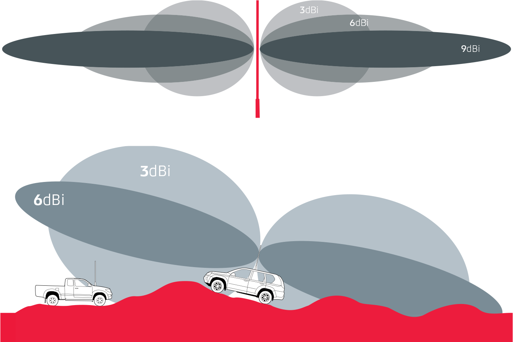

 

# Build your own LoRaWAN sensor
## Ready-to-use sensor with LoRAWAN converter
There are many ways to build a LoRaWAN sensor. The easiest one consist of pluging-in a sensor to an [LoRaWAN converter](https://eu.robotshop.com/fr/products/dragino-rs485-ln-rs485-to-lorawan-converter-868-mhz?gad_source=1&gclid=Cj0KCQjwqP2pBhDMARIsAJQ0Czo4W4Ad2Rkd8LrDPtcQDqOVRrOA1BdEKZSq0wmOhdydOwMRTf4MdNUaAlJJEALw_wcB), as sold by Arduino. 
This method is simple by avoidind coding, but is quite expansive.

## Homemade sensor
The second main method we are going to present here is more complex, but much more economic. We will build our sensor from A to Z, by implementing the code to communicate with a LoRaWAN Gateway. Let's illustrate it with concrete examples.

### With Feather M0
***WaziLab* [soil moisture active sensor](https://lab.waziup.io/solutions/waziup/automatic-irrigation) :**

This soil moisture sensor is directly linked with a water pump, to manage automaticly water spully for plants. To do nthis, they used : 
| Component | Description | Price |
| --- | --- | --- |
| WaziAct (= Feather M0 + power relay to control waterpump) | Adafruit Feather M0 Long Range (LoRa) Radio is a microcontroller with a LoRa packet radio transceive. | 40€ |
| FT232 FTDI module with Mini USB Cable | USB to TTL Serial Converter Adapter Module. | 10€ | 
| Soil Moisture Sensor | | 20€ |
| Submersible Water Pump | | 10€ |
| Some Jumper Wires | | 5€ |
| Power Supply | | 10€ | 
| Antenna | | 45€ |
| | **Total** | 140€ |

::: details How to choose the right antenna ?
Depending on the terrain, it is necessary to adapt the gain of the antenna, so its capcity to focus the output signal in an specific diection. Bigger is the gain (around 8dBi), less the signal is diffuse. ([GME](https://www.gme.net.au/au/news/understanding-antenna-gain-and-dbi/), 2024)

In large flat areas, an antenna with a strong gain is interesting. Contrarirly, in rugged zones, it is better to have an antennna with a weaj gain, or an unity gain (2.1dBi).

Antennas with a strong gain are obviously more expansive, compared to [unity gain antennas](https://shop.imst.de/wireless-modules/accessories/19/sma-antenna-for-ic880a-spi-wsa01-im880b-and-lite-gateway). In our case of study, the best solution would be to take antennas with [intermediate gain](https://www.distrelec.fr/fr/antenne-wi-fi-blanc-dbi-rp-tnc-male-168-5mm-vis-cisco-air-ant2524dw/p/30244239?trackQuery=cat-DNAV_PL_3525686&pos=2&origPos=2&origPageSize=50&track=true&sid=fcfebca9204ef3f78f3df2c3975f650e60a4bdb0), around 4dBi.
:::

**Tetraneutral [temperature sensor](https://docs.lora.tetaneutral.net/tutorials/capteur-temperature/) :** 

| Component | Description | Price |
| --- | --- | --- |
| [M0 Feather](https://www.adafruit.com/product/3178) | Adafruit Feather M0 Long Range (LoRa) Radio is a microcontroller with a LoRa packet radio transceive. | 30€ |
| [Sensor](https://fr.rs-online.com/web/p/thermistances/1241082) | Water temperature sensor | 20€ |
| [Antenna](https://www.distrelec.fr/fr/antenne-wi-fi-blanc-dbi-rp-tnc-male-168-5mm-vis-cisco-air-ant2524dw/p/30244239?trackQuery=cat-DNAV_PL_3525686&pos=2&origPos=2&origPageSize=50&track=true&sid=fcfebca9204ef3f78f3df2c3975f650e60a4bdb0) | | 40€ |
| | **Total** | 100€ |

### With Rasberry-Pi
***WaziLab* [weather station](https://lab.waziup.io/solutions/waziup/weather-station) :**

They created a [complete LoRaWAN weather station](https://lab.waziup.io/solutions/waziup/weather-station
) with the following components : 
| Component | Description | Price |
| --- | --- | --- |
| SparkFun Weather Shield Kit | The SparkFun Weather Shield is an easy-to-use Arduino shield that grants you access to barometric pressure, relative humidity, luminosity and temperature.  | 50€  |
| SparkFun Weather Meter Kit | Includes Wind Vane, Cup Anemometer and Tipping Bucket Rain Gauge to measure wind speed, wind direction, and rainfall. | 75€ |
| Arduino Uno with USB Cable | | 30€ |
| Lora SX1276 Breakout Board | Long Range Transceiver based on the SX1276 chipset. | 15€ |
| Some Jumper WiresM0 | | 5€ |
| Power Supply | | 10€ |
| | **Total** | **185€** |

::: danger WARNING
Home-made sensors are not water proof. If you plan to use it outdoors, remember to store it in a waterproof case. You can find it easily online :
- [Sonoff](https://www.domotique-store.fr/accessoires/6980-boitier-etanche-sonoff-ip66.html?gad_source=1&gclid=Cj0KCQjwwYSwBhDcARIsAOyL0fhNxBflWlKDEHmuZ8Z2kmjT_SMlFDURXIc6uCBC8RuWNV-gFOm5sroaAp15EALw_wcB) for **4€**
- [Temu](https://www.temu.com/fr/kuiper/n9.html?subj=googleshopping-landingpage&_bg_fs=1&_p_rfs=1&_x_ads_channel=google&_x_ads_sub_channel=shopping&_x_login_type=Google&_x_vst_scene=adg&mkt_rec=1&goods_id=601099530113542&sku_id=17592275353926&_x_ns_sku_id=17592275353926&_x_gmc_account=742384653&_x_ads_account=5198328713&_x_ads_set=20819421092&_x_ads_id=153466930022&_x_ads_creative_id=682926604759&_x_ns_source=g&_x_ns_gclid=Cj0KCQjwwYSwBhDcARIsAOyL0fjazpugY7K59j_NqG2mBReFrweP6MeJnG7jbpJx5hSc4TLR0CePiiQaAp3ZEALw_wcB&_x_ns_placement=&_x_ns_match_type=&_x_ns_ad_position=&_x_ns_product_id=17592275353926&_x_ns_target=&_x_ns_devicemodel=&_x_ns_wbraid=Cj4KCAjwnv-vBhBvEi4ADXlqcNO2KeMucE1s9ZlANb8-vDJV5P9fxNeMTwQljU9a169SipcPuHiWwGzZGgK_zA&_x_ns_gbraid=0AAAAAo4mICGWvyK0gbxLYzuwuhaS0WMNx&_x_ns_targetid=pla-2260871609456&gad_source=1&gclid=Cj0KCQjwwYSwBhDcARIsAOyL0fjazpugY7K59j_NqG2mBReFrweP6MeJnG7jbpJx5hSc4TLR0CePiiQaAp3ZEALw_wcB&adg_ctx=f-87174f24) for **20€**
:::

## Conclusion

| | LoRaWAN converter | With Feather M0 | With Rasberry-Pi |
|:-:|:-:|:-:|:-:|
| Autonomy | - | + | - |
| Adaptability | - | + | + |
| Price | - | + | + |
| Accessibility | + | - | - |
| Waterproof | + | - | - |
| Range | + | + | + |

