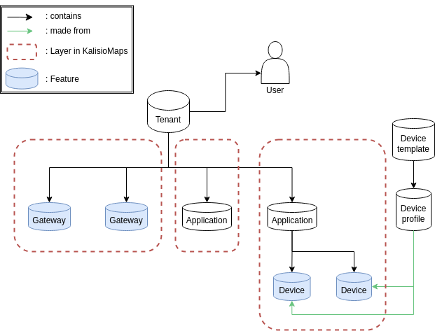

 

# The ChirpStack project
ChirpStack is an open-source LoRaWAN Network Server which can be used to to setup private or public LoRaWAN networks. ChirpStack provides a web-interface for the management of gateways, devices and tenants as well to setup data integrations with the major cloud providers, databases and services commonly used for handling device data. ChirpStack provides a gRPC based API that can be used to integrate or extend ChirpStack. ([ChirpStack](https://www.chirpstack.io/docs/index.html), 2024)

::: danger **gRPC** = framework
:::

## Network architecure

 <i> (Chirpstack, 2024) </i> 

## Main components
### ChirpStack Concentrator
ChirpStack Concentratord is an open-source LoRa concentrator daemon. It exposes a ZeroMQ based API that can be used by one or multiple (forwarder) applications to interact with the gateway hardware.

### ChirpStack MQTT Forwarder
ChirpStack MQTT Forwarder is an open-source Protobuf or JSON MQTT packet forwarder, which can either use the Semtech UDP Packet Forwarder or ChirpStack Concentratord as gateway backend. It is intended to be installed on each gateway.

::: danger **MQTT** =  OASIS standard messaging protocol for the Internet of Things (IoT)
:::

### ChirpStack Gateway Bridge
ChirpStack Gateway Bridge is an open-source bridge which converts messages received from the Semtech UDP Packet Forwarder or Semtech Basics Station into MQTT. It can be installed on the gateway, or in the cloud.

### ChirpStack
ChirpStack is an open-source LoRaWAN Network Server which can be used to to setup private or public LoRaWAN networks. ChirpStack provides a web-interface for the management of gateways, devices and tenants as well to setup data integrations with the major cloud providers, databases and services commonly used for handling device data. ChirpStack provides a gRPC based API that can be used to integrate or extend ChirpStack.

## Organisation

 <i> ChirpStack components </i>

ChirpStack is made for collaborative use. It involves many rules and a specific organisation to offer an easy and efficient service, around these following notions.

### Tenant
A tenant is a set of users, who constitute a organisation. In a tenant, each of the users has unique rights, in therms of settings and participation.

### Gateway
Here it is quite explicit. Each tenant is set to welcome a certain number of gateways, that can be seen by every user of the tenant. To link a gateway to a tenant, you must declare it to the tenant.

::: warning 
A gateway cannot be paired to 2 differents tenants at the same time.
:::

### Application
An application is a set of sensors of your choice. As for the gateway, you must declare every new sensor to add it to a application of your tenant.

### Device
Devices are the final point of the ChirpStack's chain. It corresponds to your sensor. For each device you want to include in your network, you must provide a device profile. It helps ChirpStack to understand what kind os sensor you want to add. 

To create a device profile, go on the corresponding tab and click on *Add device profile*. Then you can create manually a device profile by filling needed informations about your sensor, or you can use a device profile template provided by ChirpStack.

These templates are available online an need to be downloaded, as explained [here](https://www.chirpstack.io/docs/chirpstack/use/device-profile-templates.html).

::: warning
A senor cannot be paired to 2 differents tenants, applications or gateways at the same time. Each sensor has each unique tenant-gateway-application set.
:::

